# SSM基础项目从零搭建

## 一、创建码云仓库

1、登陆码云，选择右上角的“+”按钮，选择新建仓库：

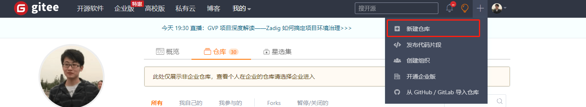


2、新建仓库的具体信息：

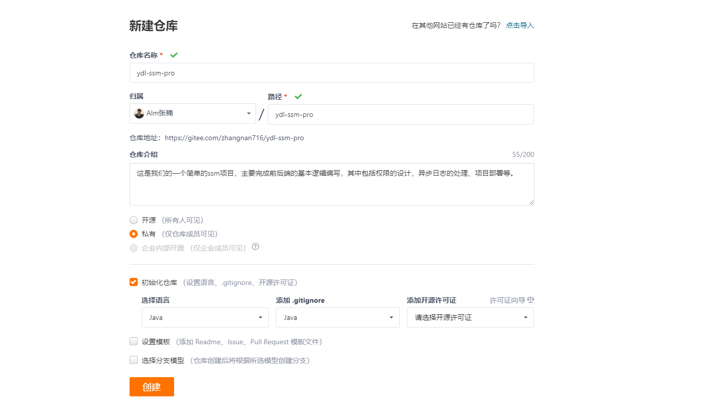

3、使用git命令克隆我们的仓库至本地：

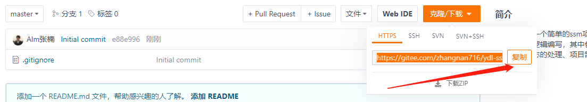


我的仓库命令如下：

```shell
git clone https://gitee.com/zhangnan716/ydl-ssm-pro.git
```

可以新增一个.gitignore文件

```shell
HELP.md
target/
!.mvn/wrapper/maven-wrapper.jar
!**/src/main/**
!**/src/test/**

### STS ###
.apt_generated
.classpath
.factorypath
.project
.settings
.springBeans
.sts4-cache

### IntelliJ IDEA ###
.idea
*.iws
*.iml
*.ipr

### NetBeans ###
/nbproject/private/
/nbbuild/
/dist/
/nbdist/
/.nb-gradle/
build/

### VS Code ###
.vscode/


mvnw
mvnw.cmd
.mvn/

*.log
```


## 二、创建前端项目


### 1、创建vue3.0脚手架工程

```shell
vue create ydl-ui
```


> 选择vue3.0版，将项目直接建立在仓库的根目录中

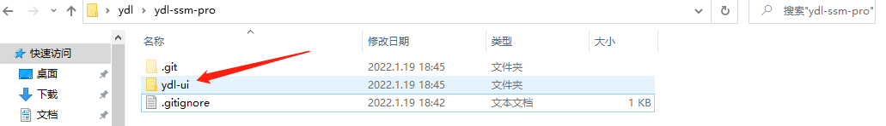


> 使用vscode打开项目工程，并启动：

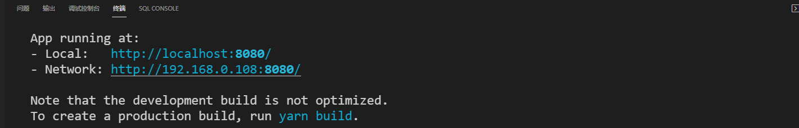


### 2、配置vue-router

https://next.router.vuejs.org/zh/index.html

####  （1）安装依赖

```shell
yarn add vue-router@4
```

#### （2）创建router目录结构

创建router目录，并创建index.js文件

```js
// 导入用来创建路由和确定路由模式的两个方法
import {
    createRouter,
    createWebHistory
} from 'vue-router'

/**
 * 定义路由信息
 * 
 */
const routes = []

// 创建路由实例并传递 `routes` 配置
// 我们在这里使用 html5 的路由模式，url中不带有#，部署项目的时候需要注意。
const router = createRouter({
    history: createWebHistory(),
    routes, 
})


// 全局的路由守卫
router.beforeEach((to, from) => {
    console.log(to)
    console.log(from)
    return true
})

// 讲路由实例导出
export default router
```

#### （3）全局安装

```js
import router from '@/router'
createApp(App).use(router).mount('#app')
```


### 3、配置vuex

https://next.vuex.vuejs.org/zh/

####  （1）安装依赖

```
yarn add vuex@next
```

#### （2）创建目录结构

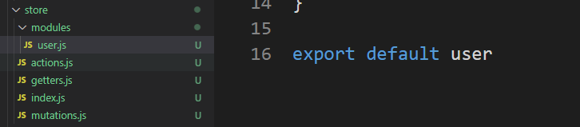

user模块

```javascript
const user = {
    state: {
    },
    getters:{   
    },
    mutations: {
    },
    actions: {
    }
}

export default user
```


index.js

```js
import { createStore } from 'vuex'
import user from '@/store/modules/user'
import actions from '@/store/actions'
import mutations from '@/store/mutations'


const store = createStore({
    modules: {
        user
    },
    actions,
    mutations
})

export default store
```

#### （3）全局引入

```js
import store from '@/store'

createApp(App).use(router).use(store).mount('#app')
```


### 4、配置axios

http://www.axios-js.com/

```shell
yarn add axios
```


创建文件目录

新建文件夹api，以后所有和后端api交互的内容全部放在此文件夹中：

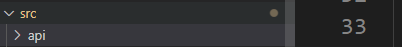

新建index.js，该文件用来定义全局的axios配置

```js
/**
 * axios的基本api
 * // 发送 POST 请求
 * axios({
 *  method: 'post',
 *  url: '/user/12345',
 *  data: {
 *    firstName: 'Fred',
 *    lastName: 'Flintstone'
 *  }
 *});
 * 
 */

import axios from 'axios'

// 创建axios实例
const request = axios.create({
    // axios中请求配置有baseURL选项，表示请求URL公共部分
    baseURL: 'http://localhost:8080/ydl/',
    // 超时
    timeout: 10000,
    // 设置Content-Type，规定了前后端的交互使用json
    headers: {'Content-Type': 'application/json;charset=utf-8'}
})
export default request
```

现在我们不妨写几个user相关的接口，感受一下：

```js
import request from "@/api";

// 新增用户
// 查询用户列表
export function listUser(query) {
    return request({
        url: '/user',
        method: 'get',
        params: query
    })
}

// 新增用户
export function addUser(data) {
    return request({
        url: '/user',
        method: 'post',
        data: data
    })
}
```


### 5、安装ui组件

```
yarn add element-plus
```

```js
import ElementPlus from 'element-plus'
import 'element-plus/dist/index.css'

createApp(App).use(router).use(vuex).use(ElementPlus).mount('#app')
```

前端项目基本搭建完成。


## 三、创建后端项目

### 1、搭建maven工程

直接把项目建立在仓库的根目录即可，当然我们也可以创建两个仓库，一个前端项目仓库，一个后端项目仓库：

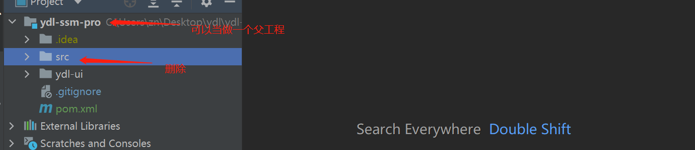


### 2、调整工程结构

创建子工程ydl-backend，删除掉父工程的src，将父工程的pom文件中的packaging改为pom，声明为一个父工程：

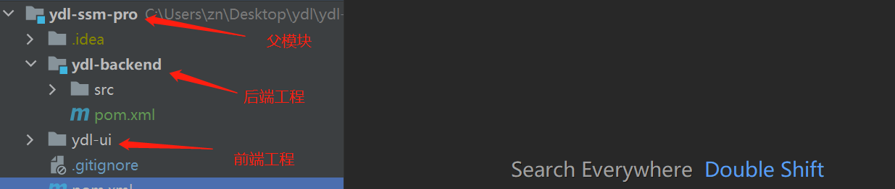


### 3、配置tomcat

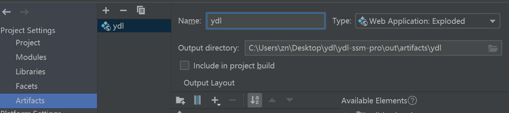


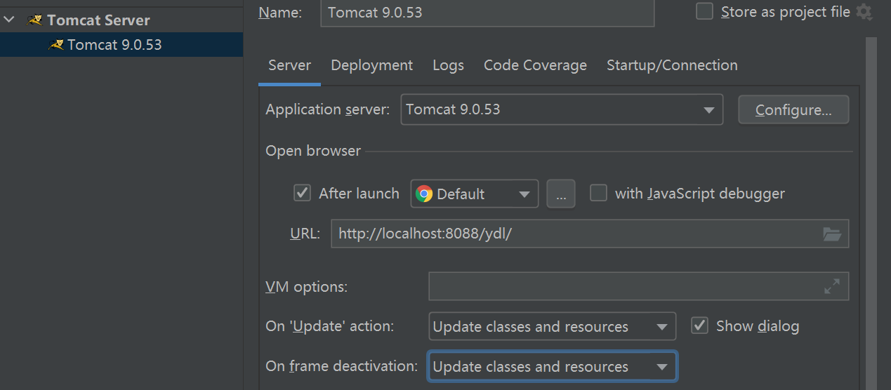


### 4、加入以下依赖

在父工程中加入以下依赖，进行依赖管理，每一个依赖的作用不在赘述，这是基本的ssm项目搭建：

```xml
<?xml version="1.0" encoding="UTF-8"?>
<project xmlns="http://maven.apache.org/POM/4.0.0"
         xmlns:xsi="http://www.w3.org/2001/XMLSchema-instance"
         xsi:schemaLocation="http://maven.apache.org/POM/4.0.0 http://maven.apache.org/xsd/maven-4.0.0.xsd">
    <modelVersion>4.0.0</modelVersion>

    <groupId>com.ydl</groupId>
    <artifactId>ydl-back</artifactId>
    <packaging>pom</packaging>
    <version>1.0-SNAPSHOT</version>
    <modules>
        <module>ydl-backend</module>
    </modules>

    <name>ruoyi</name>
    <url>http://www.ydlclass.com</url>
    <description>元动力管理系统</description>

    <properties>
        <maven.compiler.source>11</maven.compiler.source>
        <maven.compiler.target>11</maven.compiler.target>
        <project.build.sourceEncoding>utf-8</project.build.sourceEncoding>
        <javax.servlet.version>4.0.1</javax.servlet.version>
        <spring.version>5.2.18.RELEASE</spring.version>
        <spring-data-commons.version>2.6.0</spring-data-commons.version>
        <aspectjweaver.version>1.9.6</aspectjweaver.version>
        <lombok.version>1.18.22</lombok.version>
        <jackson.version>2.13.1</jackson.version>
        <validation-api.version>2.0.1.Final</validation-api.version>
        <hibernate-validator>6.0.9.Final</hibernate-validator>
        <logback-classic.version>1.2.6</logback-classic.version>
        <commons-fileupload.version>1.3.3</commons-fileupload.version>
        <druid.version>1.2.8</druid.version>
        <mysql-connector-java.version>8.0.26</mysql-connector-java.version>
        <mybatis.version>3.5.5</mybatis.version>
        <mybatis-spring.version>2.0.6</mybatis-spring.version>
    </properties>

    <!--依赖管理-->
    <dependencyManagement>
        <dependencies>
            <!--servlet-api-->
            <dependency>
                <groupId>javax.servlet</groupId>
                <artifactId>javax.servlet-api</artifactId>
                <version>${javax.servlet.version}</version>
            </dependency>

            <!--spring-webmvc-->
            <dependency>
                <groupId>org.springframework</groupId>
                <artifactId>spring-webmvc</artifactId>
                <version>${spring.version}</version>
            </dependency>
            <dependency>
                <groupId>org.springframework</groupId>
                <artifactId>spring-jdbc</artifactId>
                <version>${spring.version}</version>
            </dependency>
            <dependency>
                <groupId>org.springframework.data</groupId>
                <artifactId>spring-data-commons</artifactId>
                <version>${spring-data-commons.version}</version>
            </dependency>

            <dependency>
                <groupId>org.aspectj</groupId>
                <artifactId>aspectjweaver</artifactId>
                <version>${aspectjweaver.version}</version>
            </dependency>
            <!--lombok-->
            <dependency>
                <groupId>org.projectlombok</groupId>
                <artifactId>lombok</artifactId>
                <version>${lombok.version}</version>
            </dependency>

            <!--jackson-->
            <dependency>
                <groupId>com.fasterxml.jackson.core</groupId>
                <artifactId>jackson-core</artifactId>
                <version>${jackson.version}</version>
            </dependency>
            <dependency>
                <groupId>com.fasterxml.jackson.core</groupId>
                <artifactId>jackson-annotations</artifactId>
                <version>${jackson.version}</version>
            </dependency>
            <dependency>
                <groupId>com.fasterxml.jackson.core</groupId>
                <artifactId>jackson-databind</artifactId>
                <version>${jackson.version}</version>
            </dependency>

            <!--数据校验-->
            <dependency>
                <groupId>javax.validation</groupId>
                <artifactId>validation-api</artifactId>
                <version>${validation-api.version}</version>
            </dependency>
            <dependency>
                <groupId>org.hibernate</groupId>
                <artifactId>hibernate-validator</artifactId>
                <version>${hibernate-validator}</version>
            </dependency>

            <!--logback日志-->
            <dependency>
                <groupId>ch.qos.logback</groupId>
                <artifactId>logback-classic</artifactId>
                <version>${logback-classic.version}</version>
            </dependency>


            <!--文件上传-->
            <dependency>
                <groupId>commons-fileupload</groupId>
                <artifactId>commons-fileupload</artifactId>
                <version>${commons-fileupload.version}</version>
            </dependency>

            <!-- 数据源-->
            <dependency>
                <groupId>com.alibaba</groupId>
                <artifactId>druid</artifactId>
                <version>${druid.version}</version>
            </dependency>
            <!-- 数据区驱动-->
            <dependency>
                <groupId>mysql</groupId>
                <artifactId>mysql-connector-java</artifactId>
                <version>${mysql-connector-java.version}</version>
            </dependency>

            <!-- mybatis-->
            <dependency>
                <groupId>org.mybatis</groupId>
                <artifactId>mybatis</artifactId>
                <version>${mybatis.version}</version>
            </dependency>

            <!-- 整合spring和mybatis -->
            <dependency>
                <groupId>org.mybatis</groupId>
                <artifactId>mybatis-spring</artifactId>
                <version>${mybatis-spring.version}</version>
            </dependency>
        </dependencies>
    </dependencyManagement>

    <build>
        <plugins>
            <plugin>
                <groupId>org.apache.maven.plugins</groupId>
                <artifactId>maven-compiler-plugin</artifactId>
                <version>3.1</version>
                <configuration>
                    <source>${java.version}</source>
                    <target>${java.version}</target>
                    <encoding>${project.build.sourceEncoding}</encoding>
                </configuration>
            </plugin>
        </plugins>
    </build>

    <repositories>
        <repository>
            <id>public</id>
            <name>aliyun nexus</name>
            <url>https://maven.aliyun.com/repository/public</url>
            <releases>
                <enabled>true</enabled>
            </releases>
        </repository>
    </repositories>

</project>
```

在子工程中加入以下依赖：

```xml
<?xml version="1.0" encoding="UTF-8"?>
<project xmlns="http://maven.apache.org/POM/4.0.0"
         xmlns:xsi="http://www.w3.org/2001/XMLSchema-instance"
         xsi:schemaLocation="http://maven.apache.org/POM/4.0.0 http://maven.apache.org/xsd/maven-4.0.0.xsd">
    <parent>
        <artifactId>ydl-back</artifactId>
        <groupId>com.ydl</groupId>
        <version>1.0-SNAPSHOT</version>
    </parent>
    <modelVersion>4.0.0</modelVersion>

    <artifactId>ydl-backend</artifactId>

    <properties>
        <maven.compiler.source>11</maven.compiler.source>
        <maven.compiler.target>11</maven.compiler.target>
    </properties>

    <dependencies>
        <!--servlet-api-->
        <dependency>
            <groupId>javax.servlet</groupId>
            <artifactId>javax.servlet-api</artifactId>
        </dependency>

        <!--spring-webmvc-->
        <dependency>
            <groupId>org.springframework</groupId>
            <artifactId>spring-webmvc</artifactId>
        </dependency>
        <dependency>
            <groupId>org.springframework</groupId>
            <artifactId>spring-jdbc</artifactId>
        </dependency>
        <dependency>
            <groupId>org.springframework.data</groupId>
            <artifactId>spring-data-commons</artifactId>
        </dependency>

        <dependency>
            <groupId>org.aspectj</groupId>
            <artifactId>aspectjweaver</artifactId>
        </dependency>
        <!--lombok-->
        <dependency>
            <groupId>org.projectlombok</groupId>
            <artifactId>lombok</artifactId>
        </dependency>

        <!--jackson-->
        <dependency>
            <groupId>com.fasterxml.jackson.core</groupId>
            <artifactId>jackson-core</artifactId>
        </dependency>
        <dependency>
            <groupId>com.fasterxml.jackson.core</groupId>
            <artifactId>jackson-annotations</artifactId>
        </dependency>
        <dependency>
            <groupId>com.fasterxml.jackson.core</groupId>
            <artifactId>jackson-databind</artifactId>
        </dependency>

        <!--数据校验-->
        <dependency>
            <groupId>javax.validation</groupId>
            <artifactId>validation-api</artifactId>
        </dependency>
        <dependency>
            <groupId>org.hibernate</groupId>
            <artifactId>hibernate-validator</artifactId>
        </dependency>

        <!--logback日志-->
        <dependency>
            <groupId>ch.qos.logback</groupId>
            <artifactId>logback-classic</artifactId>
        </dependency>


        <!--文件上传-->
        <dependency>
            <groupId>commons-fileupload</groupId>
            <artifactId>commons-fileupload</artifactId>
        </dependency>

        <!-- 数据源-->
        <dependency>
            <groupId>com.alibaba</groupId>
            <artifactId>druid</artifactId>
        </dependency>
        <!-- 数据区驱动-->
        <dependency>
            <groupId>mysql</groupId>
            <artifactId>mysql-connector-java</artifactId>
        </dependency>

        <!-- mybatis-->
        <dependency>
            <groupId>org.mybatis</groupId>
            <artifactId>mybatis</artifactId>
        </dependency>

        <!-- 整合spring和mybatis -->
        <dependency>
            <groupId>org.mybatis</groupId>
            <artifactId>mybatis-spring</artifactId>
        </dependency>
    </dependencies>

</project>
```


web.xml的内容

```xml
<?xml version="1.0" encoding="UTF-8"?>
<web-app xmlns="http://xmlns.jcp.org/xml/ns/javaee"
         xmlns:xsi="http://www.w3.org/2001/XMLSchema-instance"
         xsi:schemaLocation="http://xmlns.jcp.org/xml/ns/javaee http://xmlns.jcp.org/xml/ns/javaee/web-app_4_0.xsd"
         version="4.0">
    
    <!--容器初始化时，负责启动spring容器-->
    <listener>
        <listener-class>org.springframework.web.context.ContextLoaderListener</listener-class>
    </listener>

    <context-param>
        <param-name>contextConfigLocation</param-name>
        <param-value>classpath:application.xml</param-value>
    </context-param>

    <!--注册DispatcherServlet，这是springmvc的核心，就是个servlet-->
    <servlet>
        <servlet-name>springmvc</servlet-name>
        <servlet-class>org.springframework.web.servlet.DispatcherServlet</servlet-class>
        <init-param>
            <param-name>contextConfigLocation</param-name>
            <param-value>classpath:application.xml</param-value>
        </init-param>
        <!--加载时先启动-->
        <load-on-startup>1</load-on-startup>
    </servlet>
    <!--/ 匹配所有的请求；（不包括.jsp）-->
    <!--/* 匹配所有的请求；（包括.jsp）-->
    <servlet-mapping>
        <servlet-name>springmvc</servlet-name>
        <url-pattern>/</url-pattern>
    </servlet-mapping>
</web-app>
```

jdbc.properties

```properties
user=root
password=root
url=jdbc:mysql://127.0.0.1:3306/ydlclass?characterEncoding=utf8&serverTimezone=Asia/Shanghai
driverName=com.mysql.cj.jdbc.Driver
```


application.xml，我们将spring和springmvc的配置统一在一个文件中，你也可以分开。

```xml
<?xml version="1.0" encoding="UTF-8"?>
<beans xmlns="http://www.springframework.org/schema/beans"
       xmlns:xsi="http://www.w3.org/2001/XMLSchema-instance"
       xmlns:context="http://www.springframework.org/schema/context"
       xmlns:mvc="http://www.springframework.org/schema/mvc"
       xmlns:tx="http://www.springframework.org/schema/tx"
       xmlns:mybatis="http://mybatis.org/schema/mybatis-spring"
       xsi:schemaLocation="http://www.springframework.org/schema/beans
       http://www.springframework.org/schema/beans/spring-beans.xsd
       http://www.springframework.org/schema/context
       https://www.springframework.org/schema/context/spring-context.xsd
       http://www.springframework.org/schema/tx
       https://www.springframework.org/schema/tx/spring-tx.xsd
       http://mybatis.org/schema/mybatis-spring
       https://mybatis.org/schema/mybatis-spring.xsd
       http://www.springframework.org/schema/mvc
       https://www.springframework.org/schema/mvc/spring-mvc.xsd">
    <!-- 自动扫包 -->
    <context:component-scan base-package="com.ydlclass"/>
    

    <!--文件上传配置-->
    <bean id="multipartResolver" class="org.springframework.web.multipart.commons.CommonsMultipartResolver">
        <!-- 请求的编码格式，必须和jSP的pageEncoding属性一致，以便正确读取表单的内容，默认为ISO-8859-1 -->
        <property name="defaultEncoding" value="utf-8"/>
        <!-- 上传文件大小上限，单位为字节（10485760=10M） -->
        <property name="maxUploadSize" value="10485760"/>
        <property name="maxInMemorySize" value="40960"/>
    </bean>

    <!-- 处理映射器 -->
    <bean class="org.springframework.web.servlet.handler.BeanNameUrlHandlerMapping"/>
    <!-- 处理器适配器 -->
    <bean class="org.springframework.web.servlet.mvc.SimpleControllerHandlerAdapter"/>
    <!-- 视图解析器,本项目可以不使用视图解析器-->
    <bean class="org.springframework.web.servlet.view.InternalResourceViewResolver" id="internalResourceViewResolver">
        <!-- 前缀 -->
        <property name="prefix" value="/WEB-INF/page/"/>
        <!-- 后缀 -->
        <property name="suffix" value=".jsp"/>
        <property name="order" value="10"/>
    </bean>

    <bean id="customObjectMapper" class="com.ydlclass.configuration.CustomObjectMapper"/>
    
    <!--全局异常处理-->
    <!--    <bean class="com.ydlclass.handler.GlobalExceptionResolver"/>-->

    <mvc:annotation-driven>
        <mvc:message-converters>
            <bean class="org.springframework.http.converter.json.MappingJackson2HttpMessageConverter">
                <!-- 自定义Jackson的objectMapper -->
                <property name="objectMapper" ref="customObjectMapper"/>
                <!-- 自定义Jackson的objectMapper -->
                <property name="supportedMediaTypes">
                    <list>
                        <value>text/plain;charset=UTF-8</value>
                        <value>application/json;charset=UTF-8</value>
                    </list>
                </property>
            </bean>
        </mvc:message-converters>
    </mvc:annotation-driven>

    <!--处理静态资源，前后分离项目不需要处理静态资源-->
    

    <!--扫描mapper文件-->
    <!--  让springmvc自带的注解生效  -->
    <context:property-placeholder location="classpath:jdbc.properties"/>
    <mybatis:scan base-package="com.ydlclass.dao"/>

    <!--数据源-->
    <bean id="dataSource" class="com.alibaba.druid.pool.DruidDataSource">
        <property name="url" value="${url}"/>
        <property name="driverClassName" value="${driverName}"/>
        <property name="username" value="${user}"/>
        <property name="password" value="${password}"/>
    </bean>

    <!-- 整个整合就是在围绕sqlSessionFactory -->
    <bean id="sqlSessionFactory" class="org.mybatis.spring.SqlSessionFactoryBean">
        <property name="dataSource" ref="dataSource"/>
        <property name="mapperLocations" value="classpath:mapper/**/*.xml"/>
        <property name="configuration">
            <bean class="org.apache.ibatis.session.Configuration">
                <property name="mapUnderscoreToCamelCase" value="true"/>
                <property name="logPrefix" value="ydlclass_"/>
            </bean>
        </property>
    </bean>
    
    <!-- 注入事务管理器 -->
    <bean id="transactionManager" class="org.springframework.jdbc.datasource.DataSourceTransactionManager">
        <property name="dataSource" ref="dataSource"/>
    </bean>
    
    <!-- 声明式事务 -->
    <tx:advice id="txAdvice" transaction-manager="transactionManager">
        <!-- the transactional semantics... -->
        <tx:attributes>
            <!-- all methods starting with 'get' are read-only -->
            <tx:method name="get*" read-only="true" propagation="SUPPORTS"/>
            <tx:method name="select*" read-only="true" propagation="SUPPORTS"/>
            <!-- other methods use the default transaction settings (see below) -->
            <tx:method name="update*" read-only="false" propagation="REQUIRED"/>
            <tx:method name="delete*" read-only="false" propagation="REQUIRED"/>
            <tx:method name="insert*" read-only="false" propagation="REQUIRED"/>
        </tx:attributes>
    </tx:advice>

</beans>
```


logback日志的配置文件 logback.xml：

```xml
<?xml version="1.0" encoding="UTF-8"?>
<configuration>
    <!-- 日志存放路径 -->
	<property name="log.path" value="D://ydl/logs" />
    <!-- 日志输出格式 -->
	<property name="log.pattern" value="%d{HH:mm:ss.SSS} [%thread] %-5level %logger{20} - [%method,%line] - %msg%n" />

	<!-- 控制台输出 -->
	<appender name="console" class="ch.qos.logback.core.ConsoleAppender">
		<encoder>
			<pattern>${log.pattern}</pattern>
		</encoder>
	</appender>
	
	<!-- 系统日志输出 -->
	<appender name="file_info" class="ch.qos.logback.core.rolling.RollingFileAppender">
	    <file>${log.path}/sys-info.log</file>
        <!-- 循环政策：基于时间创建日志文件 -->
		<rollingPolicy class="ch.qos.logback.core.rolling.TimeBasedRollingPolicy">
            <!-- 日志文件名格式 -->
			<fileNamePattern>${log.path}/sys-info.%d{yyyy-MM-dd}.log</fileNamePattern>
			<!-- 日志最大的历史 60天 -->
			<maxHistory>60</maxHistory>
		</rollingPolicy>
		<encoder>
			<pattern>${log.pattern}</pattern>
		</encoder>
		<filter class="ch.qos.logback.classic.filter.LevelFilter">
            <!-- 过滤的级别 -->
            <level>INFO</level>
            <!-- 匹配时的操作：接收（记录） -->
            <onMatch>ACCEPT</onMatch>
            <!-- 不匹配时的操作：拒绝（不记录） -->
            <onMismatch>DENY</onMismatch>
        </filter>
	</appender>
	
	<appender name="file_error" class="ch.qos.logback.core.rolling.RollingFileAppender">
	    <file>${log.path}/sys-error.log</file>
        <!-- 循环政策：基于时间创建日志文件 -->
        <rollingPolicy class="ch.qos.logback.core.rolling.TimeBasedRollingPolicy">
            <!-- 日志文件名格式 -->
            <fileNamePattern>${log.path}/sys-error.%d{yyyy-MM-dd}.log</fileNamePattern>
			<!-- 日志最大的历史 60天 -->
			<maxHistory>60</maxHistory>
        </rollingPolicy>
        <encoder>
            <pattern>${log.pattern}</pattern>
        </encoder>
        <filter class="ch.qos.logback.classic.filter.LevelFilter">
            <!-- 过滤的级别 -->
            <level>ERROR</level>
			<!-- 匹配时的操作：接收（记录） -->
            <onMatch>ACCEPT</onMatch>
			<!-- 不匹配时的操作：拒绝（不记录） -->
            <onMismatch>DENY</onMismatch>
        </filter>
    </appender>
	
	<!-- 系统模块日志级别控制  -->
	<logger name="com.ydl" level="info" />
	<!-- Spring日志级别控制  -->
	<logger name="org.springframework" level="warn" />

	<root level="info">
		<appender-ref ref="console" />
        <appender-ref ref="file_info" />
        <appender-ref ref="file_error" />
	</root>
	
</configuration> 
```


创建CustomObjectMapper来配置jackson的序列化和反序列化：

```java
public class CustomObjectMapper extends ObjectMapper {

    public CustomObjectMapper() {
        super();
        //去掉默认的时间戳格式
        configure(SerializationFeature.WRITE_DATES_AS_TIMESTAMPS, false);
        //设置为东八区
        setTimeZone(TimeZone.getTimeZone("GMT+8"));
        //设置日期转换yyyy-MM-dd HH:mm:ss
        setDateFormat(new SimpleDateFormat("yyyy-MM-dd HH:mm:ss"));
        // 设置输入:禁止把POJO中值为null的字段映射到json字符串中
        configure(SerializationFeature.WRITE_NULL_MAP_VALUES, false);
        // 空值不序列化
        setSerializationInclusion(JsonInclude.Include.NON_NULL);
        // 反序列化时，属性不存在的兼容处理
        getDeserializationConfig().withoutFeatures(DeserializationFeature.FAIL_ON_UNKNOWN_PROPERTIES);
        // 序列化枚举是以toString()来输出，默认false，即默认以name()来输出
        configure(SerializationFeature.WRITE_ENUMS_USING_TO_STRING, true);
    }
}
```


### 5、构建目录结构并测试：

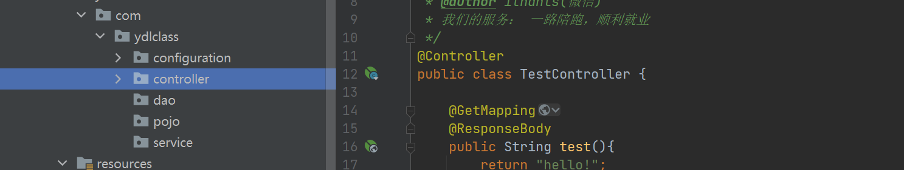


测试controller

```java
@Controller
public class TestController {

    @GetMapping("user")
    @ResponseBody
    public User test(){
        return new User("tom",12);
    }
    @ResponseBody
    public User test(){
        return new User("tom",12);
    }

    static class User{

        String username;
        Integer age;

        public User(String username, Integer age) {
            this.username = username;
            this.age = age;
        }

        public String getUsername() {
            return username;
        }

        public void setUsername(String username) {
            this.username = username;
        }

        public Integer getAge() {
            return age;
        }

        public void setAge(Integer age) {
            this.age = age;
        }
    }
}
```

启动成功：

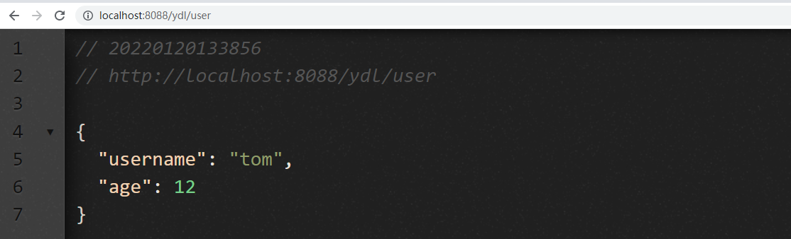


## 四、前后端联调

### 1、跨域问题

在前端app.vue中使用mounted尝试发送一个测试请求：

```js
import {listUser} from '@/api/system/user'

mounted(){
    listUser().then(res => {
        console.log(res)
    }).catch(err => {
        console.log("error"+err)
    })
}
```

请求是发送了，但是不能成功请求，很明显产生了跨越问题：

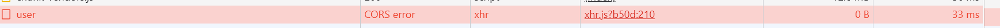


### 2、服务端解决跨域

（1）在controller或方法上加如下注解

```java
@CrossOrigin
```

（2）在配置文件中，进行全局配置

```xml
<mvc:cors>
    <mvc:mapping path="/*" allowed-methods="*" allowed-origins="*"/>
</mvc:cors>
```

测试，完成


### 3、前端配置代理

> 将服务端的api全部允许跨域访问其实并不是一个好的选择，我们更多的时候可以选择在前端服务器中配置反向代理实现跨域。

很明显，我们的前端工程也可以在一个独立的端口启动，也就是说我们的前端工程默认启动了一个web静态服务器。有了代理服务器，我们的思路也就有了。如下图：

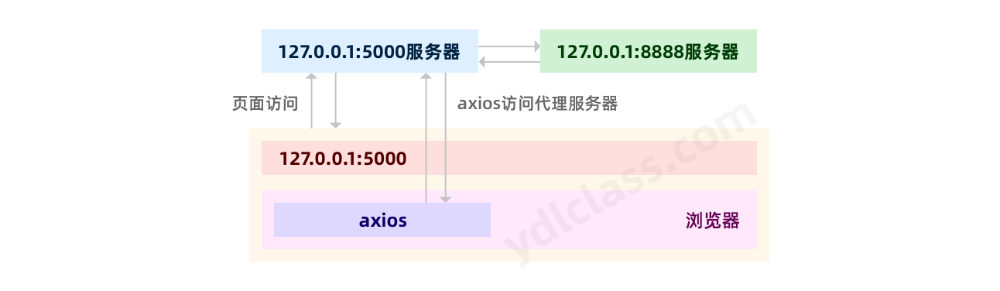


查阅vue-cli的相关配置：https://cli.vuejs.org/zh/config/，我们发现，可以vue-cli的配置是可以修改的，只需要我们建立一个 vue.config.js 配置文件文件。

#### （1）修改vue的端口，并配置代理

在工程的根目录下创建配置文件【vue.config.js】，配置代理服务器，将所有的请求交由代理发送到后端服务器。

```js
module.exports = {
    devServer: {
        port: 8088,
        proxy: 'http://localhost:8080/ydl'
    }
  }
```

#### （2）修改axios的配置

```js
// 创建axios实例
const request = axios.create({
    // axios中请求配置有baseURL选项，表示请求URL公共部分
    baseURL: 'http://localhost:8088',
    // 超时取消
    timeout: 10000,
    // 设置Content-Type，规定了前后端的交互使用json
    headers: {'Content-Type': 'application/json;charset=utf-8'}
})
```

测试，成功。


## 五、关于认证的新讨论

认证就是我们通常所说的登陆，但是随着项目结构的变化，认证的模式也会有所改变。

### 1、完成的登陆页面

将App.vue修改如下，将程序的入口仅仅保留一个`<router-view/>`，以后就可以使用单页面的方式通过路由进行页面跳转了。

```vue
<template>
  <router-view/>
</template>

<script>

</script>

<style>

</style>
```

新增登陆组件，在src下的compoment目录新建login.vue

```vue
<template>
  <el-container>
    <el-aside width="790px"
      ><el-image
        fit="fill"
        :src="require('@/assets/image/login_left.png')"
      ></el-image
    ></el-aside>
    <el-main>
      <el-card class="box-card login-card">
        <span class="login-title">元动力后台管理系统</span>
        <span class="login-tip">welcome 欢迎登陆</span>
        <el-form
          ref="user"
          :model="user"
          label-width="80px"
        >
          <el-form-item label="用户名" prop="username">
            <el-input
              v-model="user.username"
              placeholder="请输入用户"
            ></el-input>
          </el-form-item>
          <el-form-item label="密码" prop="password">
            <el-input
              v-model="user.password"
              type="password"
              placeholder="请输入密码"
              show-password
            ></el-input>
          </el-form-item>
          <el-form-item>
            <el-button type="primary" @click="login">登陆</el-button>
          </el-form-item>
        </el-form>
      </el-card>
    </el-main>
  </el-container>
</template>

<script>
export default {
  name: "login",
  data() {
    return {
      // 用户信息
      url: "../../assets/image/login_left.png",
      user: {
        username: "admin",
        password: "123456",
      },
    };
  }
};
</script>

<style scope>
.el-image {
  height: 885px;
  width: 750px;
}
.el-main {
  position: relative;
}
.login-card {
  position: absolute;
  top: 0;
  left: 0;
  bottom: 0;
  right: 0;
  margin: auto;
  width: 480px;
  height: 400px;
  padding: 50px;
}
.login-title {
  width: 459px;
  height: 70px;
  font-size: 40px;
  font-family: AlibabaPuHuiTiB;
  color: #333333;
  line-height: 90px;
  letter-spacing: 1px;
  font-weight: 800;
  display: block;
  text-align: left;
}
.login-tip {
  width: 319px;
  height: 70px;
  font-size: 30px;
  font-family: PingFangSC-Regular, PingFang SC;
  font-weight: 400;
  color: #999999;
  line-height: 90px;
  letter-spacing: 1px;
  display: block;
  text-align: left;
  margin-bottom: 30px;
}
</style>

```


我们新增一个公共的css，并导入：

```css
html,body{
    width: 100%;
    height: 100%;
    padding: 0;
    margin: 0;
}
#app {
    height: 100%;
}
```

在main.js导入即可，导入后会自动在模板中引入该css，以后如果有公共的css样式，就在这里写：

```
import '@/assets/style/common.css'
```


我们还需要新增一个主页组件：

```vue
<template>
  <el-container>
 
      <el-aside width="200px">
        <el-row>
          <el-col :span="24">
            <el-image
              style="
                width: 120px;
                height: 60px;
                display: block;
                margin: 40px auto;
              "
              fit="fill"
              :src="require('@/assets/image/main_logo.png')"
            ></el-image>
            <el-menu
              active-text-color="#ffd04b"
              background-color="#191A22"
              class="el-menu-vertical-demo"
              default-active="2"
              text-color="#fff"
            >
              <el-sub-menu index="1">
                <template #title>
                  <el-icon></el-icon>
                  <span>系统管理</span>
                </template>

                <el-menu-item index="1-1" @click="open('user')">
                  用户管理</el-menu-item
                >
                <el-menu-item index="1-2" @click="open('role')">
                  角色管理</el-menu-item
                >
              </el-sub-menu>
              <el-menu-item index="2">
                <el-icon></el-icon>
                <span>客户管理</span>
              </el-menu-item>
            </el-menu>
          </el-col>
        </el-row>
      </el-aside>
      <el-container>
        <el-header v-html="'<button onclick=\'alert(1)\'>我是攻击者的按钮</button>'"></el-header>
        <!--进行路由跳转-->
        <el-main>
          <router-view />
        </el-main>
      </el-container>
  </el-container>
</template>
<script setup>
</script>

<style scoped>
.el-container {
  height: 100%;
}

.el-header {
  margin-bottom: 20px;
  background: #e9eef3;
}

.el-footer {
  line-height: 60px;
}

.el-aside {
  background-color: #191a22;
  color: var(--el-text-color-primary);
  text-align: center;
  line-height: 200px;
}

.el-main {
  background-color: #fcfcfc;
  color: var(--el-text-color-primary);
  text-align: center;
}
</style>
```


新增路由信息

```js
const routes = [{
    name: 'login',
    path: '/login',
    component: () => import('@/components/login'),
}, {
    name: 'main',
    alias: '/',
    path: '/main',
    component: () => import('@/components/main')
}]
```


新增api

```js
// 用户登陆
export function login(data) {
    return request({
        url: '/login',
        method: 'post',
        data: data
    })
}
```


### 2、传统的登陆逻辑

根据传统的登陆逻辑我们可以这样实现，虽然前后分离这种情况下他是有问题的，但我们还是要回顾一下。

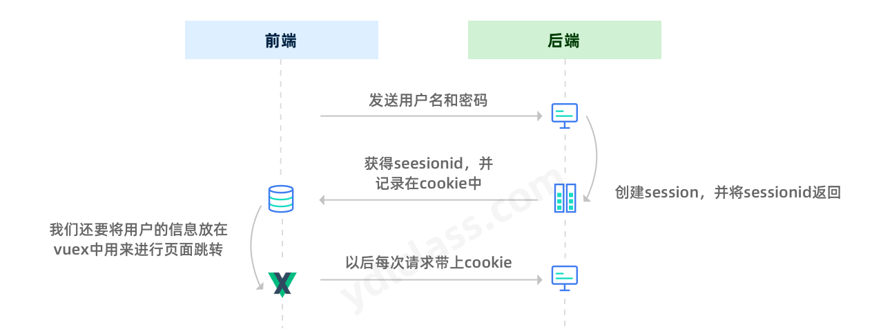


对于前端而言，登陆的逻辑不外乎就是发送用户名和密码，后端接收用户名和密码处理登陆业务，一旦登陆成功就跳转到主页。

在登陆成功后，我们需要保存一些用户信息，我们不妨将登陆的逻辑定义在vuex中的actions当中：

```js
mutations: {
    SAVE_USER(state, data) {
        state.user = data;
    }

},
actions: {
    /**
      * 此处用来处理登陆的逻辑，如果登陆成功会在vuex中保存用户的信息
      * vuex中的用户信息用来报纸用户是否已经登录
      * @param {*} param0 
      * @param {*} user 
      */
    LOGIN({ commit }, user) {
        login(user).then((res) => {
            if (res.data.code === 200) {
                commit('SAVE_USER', user);
                router.push({
                    name: "main"
                });
            }
        });
    }
}
```


**注意思考：**传统的登陆方式在这里其实是经不起推敲，因为在前后分离的项目当中，我们的前端项目和后端项目，往往不在用一个域当中（前后端的项目都是在各自的服务器中部署）。所以，在当前的环境中，cookie会失效，这样会导致http无法通过session+cookie的方式进行保持会话状态。


### 3、模拟升级

其实，本质上就是每次请求携带一个令牌就好，既然cookie+session的方式不合适了，我们不妨自己模拟一套自己的登录逻辑，使用header+redis来实现。

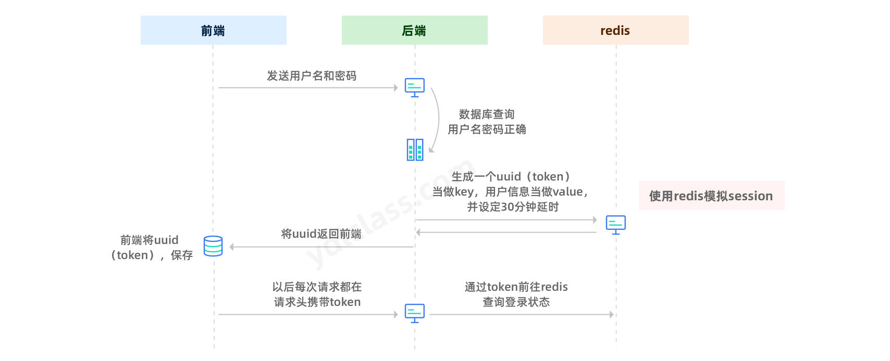


目前思路已经基本确定了，接下来我们给大家引入一个新的概念。


## 六、RBAC权限系统

通常情况下，一个系统，除了登陆也就是认证之外，还应该有一个重要的功能，就是鉴权，使用rbac可以很好的解决上述的问题。

- 认证-规定了谁能够登陆
- 鉴权-规定了谁能访问那些接口，浏览那些页面，使用哪些功能，


### 1、概述

#### （1）RBAC模型概述

RBAC模型（Role-Based Access Control：基于角色的访问控制）：其鉴权的过程可以抽象地概括为：谁 是 什么角色 有那些权限

#### （2）RBAC的组成

在RBAC模型里面，有3个基础组成部分，分别是：**用户、角色和权限。**

RBAC通过定义角色的权限，并对用户**授予某个角色**从而来**控制用户的权限**，实现了用户和权限的逻辑分离（区别于ACL模型），极大地方便了权限的管理

在讲解之前，我们先介绍一些名词：

- **User（用户）**：每个用户都有唯一的UID识别，并被授予不同的角色
- **Role（角色）**：不同角色具有不同的权限，比如：人事、会计等
- **Permission（权限**）：访问权限，比如
- 用户-角色映射：用户和角色之间的映射关系
- 角色-权限映射：角色和权限之间的映射

它们之间的关系如下图所示：


例如下图，管理员和普通用户被授予不同的权限，普通用户只能去修改和查看个人信息，而不能创建用户和冻结用户，而管理员由于被授予所有权限，所以可以做所有操作。


> 完成RBAC模型，我们需要设计五张表，如下：

用户表：

```sql
-- ----------------------------
-- 创建用户表
-- ----------------------------
DROP TABLE IF EXISTS `ydl_user`;
CREATE TABLE `ydl_user`  (
  `user_id` bigint(20) NOT NULL AUTO_INCREMENT COMMENT '用户ID',
  `user_name` varchar(30) NOT NULL COMMENT '用户账号',
  `nick_name` varchar(30)  NOT NULL COMMENT '用户昵称',
  `email` varchar(50)  NULL DEFAULT '' COMMENT '用户邮箱',
  `phonenumber` varchar(11)  NULL DEFAULT '' COMMENT '手机号码',
  `sex` char(1)  NULL DEFAULT '0' COMMENT '用户性别（0男 1女 2未知）',
  `avatar` varchar(100)  NULL DEFAULT '' COMMENT '头像地址',
  `password` varchar(100)  NULL DEFAULT '' COMMENT '密码',
  `status` char(1)  NULL DEFAULT '0' COMMENT '帐号状态（0正常 1停用）',
  `del_flag` char(1)  NULL DEFAULT '0' COMMENT '删除标志（0代表存在 2代表删除）',
  `login_ip` varchar(128)  NULL DEFAULT '' COMMENT '最后登录IP',
  `login_date` datetime NULL DEFAULT NULL COMMENT '最后登录时间',
  `create_by` varchar(64)  NULL DEFAULT '' COMMENT '创建者',
  `create_time` datetime NULL DEFAULT NULL COMMENT '创建时间',
  `update_by` varchar(64)  NULL DEFAULT '' COMMENT '更新者',
  `update_time` datetime NULL DEFAULT NULL COMMENT '更新时间',
  PRIMARY KEY (`user_id`) USING BTREE
) ENGINE = InnoDB CHARACTER SET = utf8mb4 COLLATE = utf8mb4_0900_ai_ci COMMENT = '用户信息表';

-- ----------------------------
-- 增加几条用户信息
-- ----------------------------
INSERT INTO `ydl_user` VALUES (1, 'ydl_admin', '管理员', '253546544@qq.com', '18888888888', '0', '', 'xxxxxx', '0', '0', '10.25.245.45', '2022-01-23 15:50:27', 'admin', '2022-01-23 15:50:48', 'ydl', '2022-01-26 15:50:53');
```


角色表：

```sql
-- ----------------------------
-- Table structure for ydl_role
-- ----------------------------
DROP TABLE IF EXISTS `ydl_role`;
CREATE TABLE `ydl_role`  (
  `role_id` bigint(20) NOT NULL AUTO_INCREMENT COMMENT '角色ID',
  `role_name` varchar(30)  NOT NULL COMMENT '角色名称',
  `role_tag` varchar(30)  NULL DEFAULT NULL COMMENT '角色标签',
  `role_sort` int(4) NOT NULL COMMENT '显示顺序',
  `status` char(1)  NOT NULL COMMENT '角色状态（0正常 1停用）',
  `del_flag` char(1)  NULL DEFAULT '0' COMMENT '删除标志（0代表存在 1代表删除）',
  `create_by` varchar(64)  NULL DEFAULT '' COMMENT '创建者',
  `create_time` datetime NULL DEFAULT NULL COMMENT '创建时间',
  `update_by` varchar(64)  NULL DEFAULT '' COMMENT '更新者',
  `update_time` datetime NULL DEFAULT NULL COMMENT '更新时间',
  PRIMARY KEY (`role_id`) USING BTREE
) ENGINE = InnoDB AUTO_INCREMENT = 2 CHARACTER SET = utf8mb4 COLLATE = utf8mb4_0900_ai_ci COMMENT = '角色信息表' ;

-- ----------------------------
-- Records of ydl_role
-- ----------------------------
INSERT INTO `ydl_role` VALUES (1, '管理员', NULL, 1, '0', '0', 'admin', '2022-01-28 15:57:57', 'admin', '2022-01-29 15:58:04');

```

用户-角色中间表

```sql
-- ----------------------------
-- Table structure for sys_user_role
-- ----------------------------
DROP TABLE IF EXISTS `ydl_user_role`;
CREATE TABLE `ydl_user_role`  (
  `user_id` bigint(20) NOT NULL COMMENT '用户ID',
  `role_id` bigint(20) NOT NULL COMMENT '角色ID',
  PRIMARY KEY (`user_id`, `role_id`) USING BTREE
) ENGINE = InnoDB CHARACTER SET = utf8mb4 COLLATE = utf8mb4_0900_ai_ci COMMENT = '用户和角色关联表';

-- ----------------------------
-- Records of sys_user_role
-- ----------------------------
INSERT INTO `ydl_user_role` VALUES (1, 1);
```


权限表，这个权限表是一个升级后权限表（最简单的实现有id和权限标识就可以了）

```sql
-- ----------------------------
-- Table structure for ydl_menu
-- ----------------------------
DROP TABLE IF EXISTS `ydl_menu`;
CREATE TABLE `ydl_menu`  (
  `menu_id` bigint(20) NOT NULL AUTO_INCREMENT COMMENT '菜单ID',
  `menu_name` varchar(50)  NOT NULL COMMENT '菜单名称',
  `perms` varchar(50)  NULL DEFAULT NULL COMMENT '权限标识',
  `parent_id` bigint(20) NULL DEFAULT 0 COMMENT '父菜单ID',
  `order_num` int(4) NULL DEFAULT 0 COMMENT '显示顺序',
  `path` varchar(200)  NULL DEFAULT '' COMMENT '路由地址',
  `component` varchar(255)  NULL DEFAULT NULL COMMENT '组件路径',
  `menu_type` char(1)  NULL DEFAULT '' COMMENT '菜单类型（M目录 C菜单 F按钮）',
  `visible` char(1)  NULL DEFAULT '0' COMMENT '菜单状态（0显示 1隐藏）',
  `icon` varchar(100)  NULL DEFAULT '#' COMMENT '菜单图标',
  `create_by` varchar(64)  NULL DEFAULT '' COMMENT '创建者',
  `create_time` datetime NULL DEFAULT NULL COMMENT '创建时间',
  `update_by` varchar(64)  NULL DEFAULT '' COMMENT '更新者',
  `update_time` datetime NULL DEFAULT NULL COMMENT '更新时间',
  PRIMARY KEY (`menu_id`) USING BTREE
) ENGINE = InnoDB CHARACTER SET = utf8mb4 COLLATE = utf8mb4_0900_ai_ci COMMENT = '菜单权限表' ;

-- ----------------------------
-- Records of ydl_menu
-- ----------------------------
INSERT INTO `ydl_menu` VALUES (1, '系统管理', 'system', 0, 0, 'system', 'null', '1', '0', '#', '', NULL, '', NULL);
INSERT INTO `ydl_menu` VALUES (2, '用户管理', 'system:user', 1, 1, 'system/user/index', NULL, '', '0', '#', '', NULL, '', NULL);
INSERT INTO `ydl_menu` VALUES (3, '角色管理', 'system:role', 1, 2, 'system/role/index', NULL, '', '0', '#', '', NULL, '', NULL);
INSERT INTO `ydl_menu` VALUES (4, '菜单管理', 'system:menu', 1, 3, 'system/menu/index', NULL, '', '0', '#', '', NULL, '', NULL);

```

角色和权限的中间表

```sql
-- ----------------------------
-- Table structure for sys_role_menu
-- ----------------------------
DROP TABLE IF EXISTS `ydl_role_menu`;
CREATE TABLE `ydl_role_menu`  (
  `role_id` bigint(20) NOT NULL COMMENT '角色ID',
  `menu_id` bigint(20) NOT NULL COMMENT '菜单ID',
  PRIMARY KEY (`role_id`, `menu_id`) USING BTREE
) ENGINE = InnoDB CHARACTER SET = utf8mb4 COLLATE = utf8mb4_0900_ai_ci COMMENT = '角色和菜单关联表';

-- ----------------------------
-- Records of sys_role_menu
-- ----------------------------
INSERT INTO `ydl_role_menu` VALUES (1, 1);
INSERT INTO `ydl_role_menu` VALUES (1, 2);
INSERT INTO `ydl_role_menu` VALUES (1, 3);
INSERT INTO `ydl_role_menu` VALUES (1, 4);
```


再本工程中，我们还需要一张记录操作日志的表，我们一起设计好：

```sql
DROP TABLE IF EXISTS `ydl_oper_log`;
CREATE TABLE `ydl_oper_log`  (
  `oper_id` int(11) NOT NULL AUTO_INCREMENT COMMENT '日志主键',
  `title` varchar(255)  COMMENT '操作模块',
  `business_type` varchar(255)  COMMENT '业务类型',
  `method` varchar(255)  COMMENT 'api方法',
  `request_method` varchar(255)  COMMENT '请求方式',
  `oper_name` varchar(255)  COMMENT '操作人员',
  `oper_url` varchar(255)  COMMENT '请求url',
  `oper_ip` varchar(255)  COMMENT '操作地址',
  `status` int(11) NULL DEFAULT NULL COMMENT '操作状态',
  `errorMsg` varchar(255)  COMMENT '错误消息',
  `operTime` datetime(0) NULL DEFAULT NULL COMMENT '操作时间',
  PRIMARY KEY (`oper_id`) USING BTREE
) ENGINE = InnoDB CHARACTER SET = utf8mb4 COLLATE = utf8mb4_0900_ai_ci COMMENT = '操作日志';
```

表设计好之后使用逆向工程，我们这里使用easycode反向生成基础代码：

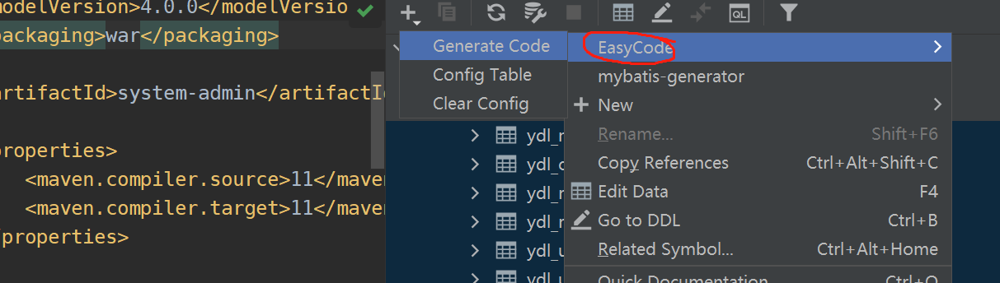


### 2、认证

#### （1）redis的搭建

开发过程中，我们可以使用windows版本的redis，启动即可，如果以后想一劳永逸，可以直接将redis设置成一个启动服务即可。

开启服务的命令如下：

```shell
安装命令：redis-server.exe --service-install redis.windows.conf --loglevel verbose
启动服务命令：redis-server.exe --service-start
关闭服务命令：redis-server.exe --service-stop
```

> 引入依赖

```xml
<dependency>
    <groupId>redis.clients</groupId>
    <artifactId>jedis</artifactId>
    <version>4.0.1</version>
</dependency>
```

> 向容器注入一个模板bean，用来操作redis：

```xml
<bean id="jedisPool" class="redis.clients.jedis.JedisPool">
    <constructor-arg name="host" value="127.0.0.1"/>
    <constructor-arg name="port" value="6379"/>
    <property name="minIdle" value="20" />
    <property name="maxIdle" value="30" />
    <property name="maxTotal" value="200"/>
</bean>
```

> 编写一个RedisTemplate，用来对redis进行基本操作：

```java
@Component
@Slf4j
public class  RedisTemplate {

    @Resource
    private JedisPool jedisPool;

    @Resource
    private CustomObjectMapper objectMapper;

    /**
     * 存储普通字符串
     * @param key
     * @param value
     * @param expire
     */
    public String set(String key, String value, Long expire) {
        Jedis jedis = jedisPool.getResource();
        String returnValue = null;
        try{
            // 如果操作成功会返回“ok”字符串，
            returnValue = jedis.setex(key, expire, value);
        }catch (JedisException e) {
            jedisPool.returnBrokenResource(jedis);
            log.error("Redis execution error !",e);
        } finally {
            jedisPool.returnResource(jedis);
        }
        return returnValue;
    }

    /**
     * 根据key获得一个字符串数据
     * @param key
     * @return
     */
    public String get(String key) {
        Jedis jedis = jedisPool.getResource();
        String returnValue = null;
        try{
            returnValue = jedis.get(key);
        }catch (JedisException e) {
            jedisPool.returnBrokenResource(jedis);
            log.error("Redis execution error !",e);
        } finally {
            jedisPool.returnResource(jedis);
        }
        return returnValue;
    }

    /**
     * 存储对象类型的数据
     * @param key
     * @param object
     * @param expire
     * @return
     */
    public String setObject(String key, Object object, Long expire) {
        Jedis jedis = jedisPool.getResource();
        String returnValue = null;
        try{
            // 讲object进行序列化
            String objValue = objectMapper.writeValueAsString(object);
            // 如果操作成功会返回“ok”字符串，
            returnValue = jedis.setex(key, expire, objValue);
        }catch (JedisException | JsonProcessingException e ) {
            jedisPool.returnBrokenResource(jedis);
            log.error("Redis execution error !",e);
        } finally {
            jedisPool.returnResource(jedis);
        }
        return returnValue;
    }

    /**
     * 获取对象类型的数据
     * @param key
     * @param valueType
     * @param <T>
     * @return
     */
    public <T> Optional<T> getObject(String key,Class<T> valueType) {


        Jedis jedis = jedisPool.getResource();
        String returnValue = null;
        try{
            // 如果操作成功会返回“ok”字符串，
            String objectValue = jedis.get(key);

            return objectValue == null ? Optional.empty() : Optional.of(objectMapper.readValue(objectValue, valueType));
        }catch (JedisException | JsonProcessingException e ) {
            jedisPool.returnBrokenResource(jedis);
            log.error("Redis execution error !",e);
        } finally {
            jedisPool.returnResource(jedis);
        }
        return Optional.empty();
    }

    public <T> Optional<T> getObject(String key, TypeReference<T> typeReference) {

        Jedis jedis = jedisPool.getResource();
        String returnValue = null;
        try{
            // 如果操作成功会返回“ok”字符串，
            String objectValue = jedis.get(key);

            return objectValue == null ? Optional.empty() : Optional.of(objectMapper.readValue(objectValue, typeReference));
        }catch (JedisException | JsonProcessingException e ) {
            jedisPool.returnBrokenResource(jedis);
            log.error("Redis execution error !",e);
        } finally {
            jedisPool.returnResource(jedis);
        }
        return Optional.empty();
    }


    /**
     * 删除多个key
     * @param key
     * @return
     */
    public Long remove(String ...key) {
        Jedis jedis = jedisPool.getResource();
        String returnValue = null;
        try{
            // 如果操作成功会返回“ok”字符串，
            return jedis.del(key);
        }catch (JedisException e) {
            jedisPool.returnBrokenResource(jedis);
            log.error("Redis execution error !",e);
        } finally {
            jedisPool.returnResource(jedis);
        }
        return -1L;
    }

    public Long lpush(String key, String ...value) {
        Jedis jedis = jedisPool.getResource();
        long pos = -1;
        try{
            // 如果操作成功会返回“ok”字符串，
            pos = jedis.lpush(key, value);
        }catch (JedisException e) {
            jedisPool.returnBrokenResource(jedis);
            log.error("Redis execution error !",e);
        } finally {
            jedisPool.returnResource(jedis);
        }
        return pos;
    }

    public Optional<String> rpop(String key) {
        Jedis jedis = jedisPool.getResource();
        Optional<String> returnValue = Optional.empty();
        try{
            // 如果操作成功会返回“ok”字符串，
            String value = jedis.rpop(key);
            System.out.println("---------"+value);
            returnValue = value == null ? Optional.empty() : Optional.of(value);
        }catch (JedisException e) {
            jedisPool.returnBrokenResource(jedis);
            log.error("Redis execution error !",e);
        } finally {
            jedisPool.returnResource(jedis);
        }
        return returnValue;
    }

    public long llen(String key) {
        Jedis jedis = jedisPool.getResource();
        long llen = -1;
        try{
            // 如果操作成功会返回“ok”字符串，
            llen = jedis.llen(key);
        }catch (JedisException e) {
            jedisPool.returnBrokenResource(jedis);
            log.error("Redis execution error !",e);
        } finally {
            jedisPool.returnResource(jedis);
        }
        return llen;
    }
}
```


#### （2）后端的登陆逻辑

在登陆逻辑中，我们还需要封装一个登陆用户的实体类，用来保存当前登陆用户的更多信息，这个类可以将来用来做登陆日志，适当的时候也可以见建表，我们这里就不建表了，他和user表不同，user保存的是一个用户的基本信息，我们可以看看其中的区别。

```java
@Data
@Builder
@NoArgsConstructor
@AllArgsConstructor
public class YdlLoginUser implements Serializable {
    private static final long serialVersionUID = 1L;

    /**
     * 用户ID
     */
    private Long userId;
    /**
     * 用户唯一标识
     */
    private String token;
    /**
     * 登录时间
     */
    private Date loginTime;
    /**
     * 登录IP地址
     */
    private String ipaddr;

    /**
     * 登录地点
     */
    private String loginLocation;
    /**
     * 浏览器类型
     */
    private String browser;
    /**
     * 操作系统
     */
    private String os;
    /**
     * 用户信息
     */
    private YdlUser ydlUser;
}
```


编写登陆相关的controller：

```java
@PostMapping("login")
public ResponseEntity<YdlLoginUser> login(@RequestBody @Validated YdlUser ydlUser,BindingResult bindingResult){
    ydlLoginUser = userService.login(ydlUser.getUserName(),ydlUser.getPassword());
    return ResponseEntity.ok().body(ydlLoginUser);
}
```


在处理登陆逻辑的service中了，此处需要使用一个依赖，该依赖能很轻松的获取浏览器和用户的一些信息，比如你的浏览器版本，操作系统版本：

```xml
<dependency>
    <groupId>eu.bitwalker</groupId>
    <artifactId>UserAgentUtils</artifactId>
    <version>1.21</version>
</dependency>
```


我们还需要一个发送http请求的工具类，这个工具类可以很轻松的发送请求，他是spring自带的，直接注入容器即可：

```java
@Configuration
public class RestConfiguration {
    @Bean
    public RestTemplate restTemplate(){
        return new RestTemplate();
    }
}
```

具体的登陆逻辑如下：

```java
@Override
public YdlLoginUser login(String userName, String password) throws JsonProcessingException {

    // 1、登陆，使用用户名查询用户，没有查询到，说明没有该账户
    YdlUser ydlUser = ydlUserDao.queryByUserName(userName);
    if(ydlUser == null) throw new UserNotFoundException("执行登陆操作：【"+ userName +"】该用户不存在");

    // 2、如果查到了，比较比较密码，密码如果不正确，登陆失败
    if(!password.equals(ydlUser.getPassword())){
        log.info("执行登陆操作：【"+ userName +"】该用户密码输入错误");
        throw new PasswordIncorrectException("执行登陆操作：【"+ userName +"】该用户密码输入错误");
    }

    // 3、如果验证成功了

    // (1) 生成token
    String token = UUID.randomUUID().toString();

    HttpServletRequest request = ((ServletRequestAttributes) Objects.requireNonNull(RequestContextHolder.getRequestAttributes())).getRequest();
    UserAgent userAgent = new UserAgent(request.getHeader("User-Agent"));

    // 通过ip获取其所属的地址
    ResponseEntity<String> result = restTemplate.getForEntity("https://whois.pconline.com.cn/ipJson.jsp?ip="+request.getRemoteHost()+"&json=true", String.class);
    String body = result.getBody();
    Map<String,String> map = objectMapper.readValue(body, new TypeReference<>() {});

    String location = map.get("addr")+map.get("pro")+map.get("city")+map.get("region");

    // (2) 封装一个YdlLoginUser，保存在redis
    YdlLoginUser ydlLoginUser = YdlLoginUser.builder()
        .userId(ydlUser.getUserId())
        .token(token)
        .ipaddr(request.getRemoteAddr())
        .loginTime(new Date())
        .os(userAgent.getOperatingSystem().getName())
        .browser(userAgent.getBrowser().getName())
        .loginLocation(location)
        .ydlUser(ydlUser)
        .build();

    //key进行处理  token:username:uuid

    // 1、根据用户名生成一个key前缀token:username:
    String keyPrefix =  Constants.TOKEN_PREFIX + userName +":";
    // 2、查询token:username:前缀的数据
    Set<String> keys = redisTemplate.keys(keyPrefix + "*");
    // 3、删除原来的数据
    keys.forEach(key -> redisTemplate.remove(key));
    // 4、把新的数据加入redis
    redisTemplate.setObject(keyPrefix + token,ydlLoginUser,Constants.TOKEN_TIME);

    return ydlLoginUser;
}
```


#### （3）前端store的处理(这个很重要)

思考，前端的数据可以存储在vuex中，也可以存在cookie中或者storage当中。

- vuex：数据是响应式的，但是刷新会清空。
- cookie中或者storage：数据不是响应式的，刷新不影响。

所以为了兼顾两者的优势，我们都使用。

为了方便使用我们创建一个工具类，这里只写了sessionStorage，你也可以加上localStorage:

```js
export default {
    saveSessionString(key,value){
        window.sessionStorage.setItem(key,value);
    },
    getSessionString(key){
        return window.sessionStorage.getItem(key);
    },
    saveSessionObject(key,value){
        window.sessionStorage.setItem(key,JSON.stringify(value));
    },
    getSessionObject(key){
        return JSON.parse(window.sessionStorage.getItem(key));
    },
    remove(key){
        return window.sessionStorage.removeItem(key);
    }

}
```

具体的业务逻辑：

```javascript
const user = {
    state: {
        username: '',
        token: '',
    },
    getters: {
        userIsLogin(state) {
            return state.username !== '' && state.token !== ''
        },
        permissions(state) {
            return state.permissions;
        }

    },
    mutations: {
        SAVE_USER(state, username) {
            state.username = username.trim();
        },
        SAVE_TOKEN(state, token) {
            state.token = token.trim();
        },
        SAVE_ROLES(state, roles) {
            state.roles = roles;
        },
        SAVE_PERMISSIONS(state, permissions) {
            state.permissions = permissions;
        }
    },
    actions: {
        /**
         * 此处用来处理登陆的逻辑，如果登陆成功会在vuex中保存用户的信息
         * vuex中的用户信息用来报纸用户是否已经登录
         * @param {*} param0 
         * @param {*} user 
         */
        LOGIN({commit}, user) {

            login(user).then((res) => {
                if (res.data.code === 200) {
                    // vuex的使用是为了保障数据的响应式
                    commit('SAVE_USER', res.data.data.user.username);
                    storage.saveSessionString("username", res.data.data.user.username)
                    commit('SAVE_TOKEN', res.data.data.token);
                    storage.saveSessionString("token", res.data.data.token)
                    router.push({
                        name: "main"
                    });
                    return new Promise(reslove => reslove(), () => { })
                }
            });
        }
}

export default user
```

在login.vue中：

```js
methods: {
    login() {
        this.$store.dispatch("LOGIN", this.user).then(() => {
            this.$store.dispatch("GET_INFO");
        });
    },
},
```

关键点来了，登陆之后我们可以获得登陆的数据还有一个token，我们其实想的是每次的访问携带上这个token这个应该怎么处理呢？

我们需要使用axios的拦截器，拦截请求，给每一个请求加一个header。

```js
// 添加请求拦截器
request.interceptors.request.use(function (config) {
  // 在发送请求之前做些什么
  if (store.state.user.token) {
    //'Bearer '
    config.headers['Authorization'] = store.state.user.token // 让每个请求携带自定义token 请根据实际情况自行修改
  }
  return config;
}, function (error) {
  // 对请求错误做些什么
  return Promise.reject(error);
});
```

这样就好了呀！

那后端怎么判断当前请求的用户是否已经登陆了呢？当然是拦截器了，只是逻辑有些变化呀！

```java
public class LoginInterceptor implements HandlerInterceptor {

    @Resource
    private RedisTemplate redisTemplate;

    @Resource
    private CustomObjectMapper objectMapper;

    @Override
    public boolean preHandle(HttpServletRequest request, HttpServletResponse response, Object handler) throws Exception {
        
        // 判断有没有Authorization这个请求头，拿到首部信息的Authorization的值
        ResponseEntity<String> res = ResponseEntity.status(401).body("Bad Credentials!");
        String token = request.getHeader(Constants.HEAD_AUTHORIZATION);

        if (token == null) {
            response.setStatus(401);
            response.getWriter().write(objectMapper.writeValueAsString(res));
            return false;
        }
        //        String tokenKey = Constants.TOKEN_PREFIX + request.getHeader("username")+":"+token;
        Set<String> keys = redisTemplate.keys(Constants.TOKEN_PREFIX + "*" + token);
        if (keys== null || keys.size() == 0){
            response.setStatus(401);
            response.getWriter().write(objectMapper.writeValueAsString(res));
            return false;
        }
        String tokenKey = (String)keys.toArray()[0];
        // 3、使用token去redis中查看，有没有对应的loginUser
        YdlLoginUser ydlLoginUser = redisTemplate.getObject(tokenKey, new TypeReference<>() {
        });
        if (ydlLoginUser == null) {
            response.setStatus(401);
            response.getWriter().write(objectMapper.writeValueAsString(res));
            return false;
        }
        // 给token续命
        redisTemplate.expire(tokenKey,Constants.TOKEN_TIME);

        return true;
    }
}
```

目前，我们的前后端的核心内容就已经处理完了。


#### （4）数据校验

1、在前端处理表单数据：

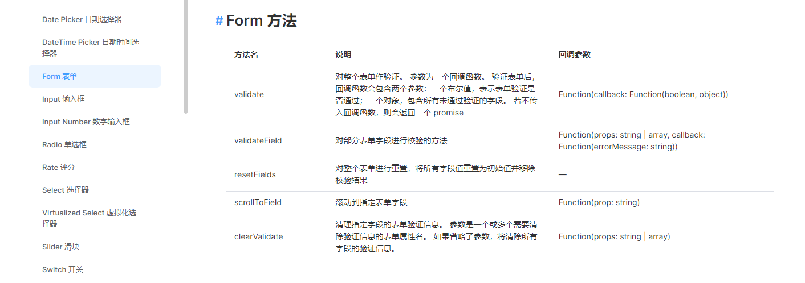


**选项式api的写法：**

```html
<el-form ref="formRef" :rules="loginRules" :model="user" label-width="60px">
```

定义规则，定义在data中即可：

```js
loginRules: {
    username: [
        { required: true, trigger: "blur", message: "用户名不能为空" }
    ],
        password: [
            { required: true, trigger: "blur", message: "密码不能为空" }
        ],
            code: [{ required: true, trigger: "change", message: "验证码不能为空" }]
},
```

使用以下方法包裹登陆的方法调用即可：

```js
login() {
    this.$$refs.formRef.validate((validate) => {
        if (validate) {
            // 登陆完成后立刻获取用户的信息
            this.$store.dispatch("LOGIN", this.user).then(() => {
                this.$store.dispatch("GET_INFO");
            });
        }
    });
},
```

**开始页面转跳到主页**

#### （5）登出的实现

**前端登出**

login/index.js

```js
		
methods: {
			doLogin() {
				this.$refs.user.validate(valid =>{
					if(valid){
						this.$store.dispatch("LOGIN", this.user).then(res =>{
							if(res.status === 200){
							   this.$router.push({name:"main"});
							   ElMessage({
							     showClose: true,
							     message: '登录成功!',
							     type: 'success',
							   })
							}
						});
						
					}else{
						   ElMessage({
						     showClose: true,
						     message: 'Your Data Is ERROR!',
						     type: 'error',
						   })
					}
				})
				
```

main/index.js

```js
<script setup>
import { computed } from 'vue';
import { useStore } from 'vuex';

import {useRouter} from 'vue-router'

import { ElMessage } from 'element-plus'

// 获取 Vuex 的 store 实例
const store = useStore();

const router = useRouter();

// 通过 store 访问 nickname，使用 computed 使其响应式
const nickname = computed(() => store.state.user.nickname);

//登出的方法
let doLogout = function(){
	store.dispatch('LOGOUT').then(res =>{
		console.log(res);
		router.push({name :'login'});
		ElMessage({
		  showClose: true,
		  message: '退出成功!',
		  type: 'success',
		})
	});
}

</script>
```

modules/user.js

```js
	LOGOUT({commit}) {
		return new Promise(function(resolve) {
			logout().then(res => {
				//需要将获取的数据保存起来
				commit("SAVE_USERNAME", '');
	
				commit("SAVE_NICKNAME", '');
	
				commit("SAVE_TOKEN", '');
				storage.remove("loginUser");
				resolve(res);
			})
		})
	
	}
```

api/user/index.js

```js
export function logout() {
    return request({
        url: '/logout',
        method: 'get'
    })
}
```


后端写登出实现

IndexController

```java
  //登出开始
    @GetMapping("logout")
    public ResponseEntity<String> login(){
        //执行登出逻辑
        try {
            userService.logout();
        } catch (Exception e) {
            e.printStackTrace();
            return ResponseEntity.status(500).build();
        }
        //等到登录用户然后返回
        return ResponseEntity.ok().body("退出成功！");
    }
```

impl

```js
    @Override
    public void logout() {
        //获取头部信息
        HttpServletRequest request = ((ServletRequestAttributes) Objects.requireNonNull(RequestContextHolder.getRequestAttributes())).getRequest();
        //获取首部信息的token
        String token = request.getHeader(Constants.HEAD_AUTHORIZATION);
        //删除redis中user的token信息
        redisTemplate.remove(Constants.TOKEN_PREFIX + token);
    }
```


后端的数据校验

```java
@Data
@AllArgsConstructor
@NoArgsConstructor
public class YdlUser extends YdlBaseEntity implements Serializable {
    private static final long serialVersionUID = 636710183710512845L;
    /**
     * 用户ID
     */
    private Long userId;
    /**
     * 用户账号
     */
    @NotNull
    @Size(min = 5,max = 15,message = "用户名的长度应该在5到15之间")
    private String userName;
    /**
     * 用户昵称
     */
    @NotNull
    private String nickName;
    ....
}
```

使用BindingResult对后端的数据进行校验：

```java
@PostMapping("login")
public ResponseEntity<YdlLoginUser> login(@RequestBody @Validated YdlUser ydlUser,BindingResult bindingResult){
    // 1、处理不合法的数据
    System.out.println(ydlUser.getUserName()+"< > ＜＞");
    List<ObjectError> allErrors = bindingResult.getAllErrors();
    allErrors.forEach( error -> log.error("登陆时用户校验失败：{}",error.getDefaultMessage()));
    if(allErrors.size() > 0){
        return ResponseEntity.status(500).build();
    }

    // 2、 执行登陆逻辑
    YdlLoginUser ydlLoginUser = null;
    try {
        ydlLoginUser = userService.login(ydlUser.getUserName(),ydlUser.getPassword());
    } catch (JsonProcessingException e) {
        e.printStackTrace();
        return ResponseEntity.status(500).build();
    }
    return ResponseEntity.ok().body(ydlLoginUser);
}
```


### 3、鉴权

#### （1）后端处理鉴权

定义获取权限信息的接口：

```java
@GetMapping("getInfo")
public ResponseEntity<HashMap<String, List<String>>> getInfo() {
    return ResponseEntity.ok(this.ydlUserService.getInfo());
}
```

三表联查查询某个用户的权限信息：

```xml
<select id="getInfo" resultMap="UserMap">
    SELECT
    u.user_id user_id,
    username,
    nick_name,
    r.role_id,
    r.role_name,
    r.role_tag,
    m.menu_id,
    m.menu_name,
    m.perms
    FROM
    ydl_user u
    LEFT JOIN `ydl_user_role` ur ON u.user_id = ur.user_id
    LEFT JOIN ydl_role r ON ur.role_id = r.role_id
    LEFT JOIN ydl_role_menu rm ON r.role_id = rm.role_id
    LEFT JOIN ydl_menu m ON rm.menu_id = m.menu_id
    where u.del_flag = 0 and r.del_flag = 0 and u.user_id = #{userId}
</select>
```

处理获取权限信息的业务：

```java
@Override
public HashMap<String,List<String>> getInfo() {
    // 1、获取当前登陆的对象
    YdlLoginUser loginUser = getLoginUser();

    // 2、查询当前用户的角色和权限
    YdlUser info = ydlUserDao.getInfo(loginUser.getUserId());

    // 3、处理权限和角色的相关信息
    // (1) roles:token : [admin,xxx,yyy]   perms:token: [system:user:add,system:user:update]
    List<String> roleTags = info.getYdlRoles().stream().map(YdlRole::getRoleTag).collect(Collectors.toList());
    redisTemplate.setObject(Constants.ROLE_PREFIX + loginUser.getToken(),roleTags,Constants.TOKEN_TIME);

    List<String> prems = new ArrayList<>();
    // [{roleName:cc,roleTag:xxx,perms:[{id,'xxx',perm:'system'},{id,'xxx',perm:'system'}]},{}]
    // [[{id,'xxx',perm:'system'},{id,'xxx',perm:'system'}],[{id,'xxx',perm:'system'},{id,'xxx',perm:'system'}]]
    // ['system','system:user:add']
    info.getYdlRoles().stream().map(YdlRole::getYdlMenus).forEach(menus -> {
        prems.addAll(menus.stream().map(YdlMenu::getPerms).collect(Collectors.toList()));
    });
    redisTemplate.setObject(Constants.PERM_PREFIX + loginUser.getToken(),prems,Constants.TOKEN_TIME);

    // 整合数据
    HashMap<String,List<String>> data = new HashMap<>();
    data.put("roles",roleTags);
    data.put("perms",prems);

    return data;
}


// 获取当前登陆用户的方法
private YdlLoginUser getLoginUser(){

    HttpServletRequest request = ((ServletRequestAttributes) Objects.requireNonNull(RequestContextHolder.getRequestAttributes())).getRequest();
    // 获取首部信息的token
    String token = request.getHeader(Constants.HEAD_AUTHORIZATION);

    if (token == null) {
        throw new RuntimeException("当前用户未登录！");
    }
    Set<String> keys = redisTemplate.keys(Constants.TOKEN_PREFIX + "*" + token);
    if (keys== null || keys.size() == 0){
        throw new RuntimeException("当前用户未登录！");
    }
    String tokenKey = (String)keys.toArray()[0];
    // 3、使用token去redis中查看，有没有对应的loginUser
    return redisTemplate.getObject(tokenKey, new TypeReference<>() {});
}
```


java在处理权限上的技巧：

我们已经获取了当前登陆用户的所有权限，但是怎么才能保障其他没有该权限的用户就不能访问这个接口呢？我们当然可以在每个方法里写上判断逻辑，但是显然是比较麻烦的。

这里我们就可以使用**切面**了，切面的核心功能之一就是抽离共同逻辑的代码，然后对目标方法进行增强。为了能够更加灵活的确定哪些接口需要设置权限，需要什么权限，我们使用注解进行标的。

定义以下两个注解：

这个注解用来标识一个接口需要拥有什么权限的人才能访问：

```java
@Target(ElementType.METHOD)
@Retention(RetentionPolicy.RUNTIME)
public @interface HasPermission {
    String[] value();
}
```

这个注解用来标识一个接口需要拥有什么角色的人才能访问：

```java
@Target(ElementType.METHOD)
@Retention(RetentionPolicy.RUNTIME)
public @interface HasRole {
    String[] value();
}
```

使用aop之前，我们需要开启自动代理：

```xml
 <aop:aspectj-autoproxy/>
```

```java
@Component
@Aspect
public class PermissionAspect {

    @Resource
    private RedisTemplate redisTemplate;

    /**
     * 执行接口所需角色的切面
     * @param joinPoint
     * @param hasRole
     */
    @Before("@annotation(hasRole)")
    public void roleBefore(JoinPoint joinPoint, HasRole hasRole){
        // 获得当前方法所需要的角色
        String[] needRoles = hasRole.value();
        // 获得拥有的角色
        HttpServletRequest request = ((ServletRequestAttributes) Objects.requireNonNull(RequestContextHolder.getRequestAttributes())).getRequest();
        String token = request.getHeader(Constants.HEAD_AUTHORIZATION);
        List<String> hasRoles = redisTemplate.getObject(Constants.ROLE_PREFIX + token, new TypeReference<>() {
        });
        // 只要所需的角色有一个在你拥有的角色中就放行
        boolean flag = false;
        for (String needRole : needRoles) {
            if (hasRoles.contains(needRole)) {
                flag = true;
                break;
            }
        }
        if(!flag) throw new RoleNeedHasException("您没有该接口所需要的角色");
    }

    @Before("@annotation(hasPermission)")
    public void roleBefore(JoinPoint joinPoint, HasPermission hasPermission){
        // 获得当前方法所需要的权限
        String[] needPermissions = hasPermission.value();
        // 获得拥有的权限
        HttpServletRequest request = ((ServletRequestAttributes) Objects.requireNonNull(RequestContextHolder.getRequestAttributes())).getRequest();
        String token = request.getHeader(Constants.HEAD_AUTHORIZATION);
        List<String> hasPermissions = redisTemplate.getObject(Constants.PERM_PREFIX + token, new TypeReference<>() {
        });
        // 只要所需的角色有一个在你拥有的角色中就放行
        boolean flag = false;
        for (String needPermission : needPermissions) {
            if (hasPermissions.contains(needPermission)) {
                flag = true;
                break;
            }
        }
        if(!flag) throw new PermissionNeedHasException("您没有该接口所需要的角色");
    }

}
```


#### （2）前端处理鉴权

前端也是要保存权限信息的。前端的处理逻辑其实并不难，我们可以通过v-if来进行判断，但是v-if使用起来比较麻烦，我们采用一种新的技术-自定义指令。

首先，将获取的权限信息保存在vuex

完善一下store的代码

```js
const user = {
    state: {
        username: '',
        token: '',
        roles: [],
        permissions: []
    },
    getters: {
        userIsLogin(state) {
            return state.username !== '' && state.token !== ''
        },
        permissions(state) {
            return state.permissions;
        }

    },
    mutations: {
        SAVE_USER(state, username) {
            state.username = username.trim();
        },
        SAVE_TOKEN(state, token) {
            state.token = token.trim();
        },
        SAVE_ROLES(state, roles) {
            state.roles = roles;
        },
        SAVE_PERMISSIONS(state, permissions) {
            state.permissions = permissions;
        }
    },
    actions: {
       LOGIN({ commit }, user) {
            return new Promise(function (resolve) {
                login(user).then(res => {
                    // 需要将获取的数据，保存起来
                    commit("SAVE_USERNAME", res.data.ydlUser.userName);
                    commit("SAVE_NICKNAME", res.data.ydlUser.nickName);
                    commit("SAVE_TOKEN", res.data.token);
                    storage.saveSessionObject("loginUser", res.data);
                    resolve(res);
                })
            })
        },
        GET_INFO({ commit }) {
            return new Promise(resolve => {
                getInfo().then(res => {
                    commit("SAVE_ROLES", res.data.roles);
                    commit("SAVE_PERMISSIONS", res.data.perms);
                    resolve();
                })
            })
        },
        LOGOUT({ commit }) {
            return new Promise(function (resolve) {
                logout().then(res => {
                    // 需要将获取的数据，保存起来
                    commit("SAVE_USERNAME", '');
                    commit("SAVE_NICKNAME", '');
                    commit("SAVE_TOKEN", '');
                    storage.remove("loginUser");
                    resolve(res);
                })
            })
        },
    }
}

export default user
```


我们可以通过自定义指令，建立directive目录用来存放新增的指令：

```js
import store from '@/store'

export default {
    // v-hasPermissions="system:user:add,system:user:query"
    hasPermission: {
        mounted(el, binding) {
            const { value } = binding
            console.log(value)
            const all_permission = "*:*:*";
            const permissions = store.getters && store.getters.permissions
            if (value && value instanceof Array && value.length > 0) {
                const hasPermissions = permissions.some(permission => {
                    return all_permission === permission || value.includes(permission)
                })
                if (!hasPermissions) {
                    // 移除掉当前的element
                    el.parentNode && el.parentNode.removeChild(el)
                }
            } else {
                throw new Error(`请设置操作权限标签值`)
            }
        }
    },
    hasRole: {
        mounted(el, binding) {
            const { value } = binding
            
            // const all_permission = "admin";
            const permissions = store.getters && store.getters.roles
            if (value && value instanceof Array && value.length > 0) {
                console.log(value)
                console.log("p--"+permissions)
                const hasRoles = permissions.some(role => {
                    return value.includes(role)
                })
                if (!hasRoles) {
                    // 移除掉当前的element
                    el.parentNode && el.parentNode.removeChild(el)
                }
            } else {
                throw new Error(`请设置操作权限标签值`)
            }
        }
    }

}
```


 在main.js中保存

```js
// 安装所有的自定义指令
for(let key in directives ){
    console.log(key)
    app.directive(key,directives[key]);
}
```

以后所有的组件都可以使用了。

```html
<el-button v-hasPermi="['system:user:edit']" type="primary" :icon="Edit" >编辑</el-button>
```


## 七、日志的处理

- 日志是一个系统中比较重要的部分，用来记录与业务相关的信息，但是又和业务本身无关，需要和业务主体松耦合。日志我们可以输出在控制台，日志文件以及数据库。
- 日志的输出通常伴随着IO，其中大量的日志输出可能会导致阻塞，举个例子，我们有一张日志表，当所有的接口都向这张表插入操作数据的时候会因为update语句频繁锁表，而导致业务接口执行缓慢。所以我们的日志输出通常是要使用异步操作的，使用独立的线程池来完成异步日志的处理，这样日志的阻塞不会影响其他的业务。


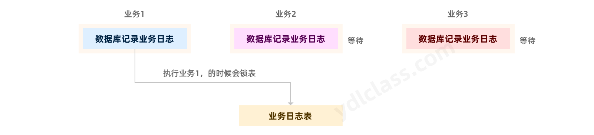


### 1、普通日志

我们已经配置了日志相关的内容，通用的日志我们选择了slf4j+logback。logback的配置我们不再详细介绍，有兴趣的同学可以查看我前边的日志相关的教程。当然logback也是支持**异步日志**的，如果需要可以进行配置。但是文件的日志不会有类似锁表的情况，仅仅存在一些iO，所以按照公司要求配置即可。

### 2、数据库日志

有些时候，我们同样需要将一些日志记录在数据库，比如一些接口调用的日志，用户登陆的日志等。这种日志通常有以下几个特点：

（1）日志的打印方式雷同，数据格式雷同

（2）日志通常无需和业务耦合

（3）日通通常伴随IO，锁表等问题，可能会影响核心业务的执行

针对以上的问题，我们的处理逻辑通常是如下，这里我们以操作日志为例：

> 定义如下的实体类，我们使用逆向工程生成对应代码

```java
@Data
@AllArgsConstructor
@NoArgsConstructor
public class OperLog implements Serializable {

    private static final long serialVersionUID = 1L;

    /**
     * 日志主键
     */
    private Long operId;

    /**
     * 日志内容
     */
    private String content;

    /**
     * 业务类型（0其它 1新增 2修改 3删除）
     */
    private Integer businessType;


    /**
     * api方法
     */
    private String method;

    /**
     * 请求方式
     */
    private String requestMethod;


    /**
     * 操作人员
     */
    private String operName;


    /**
     * 请求url
     */
    private String operUrl;

    /**
     * 操作地址
     */
    private String operIp;

    /**
     * 操作状态（0正常 1异常）
     */
    private Integer status;

    /**
     * 错误消息
     */
    private String errorMsg;

    /**
     * 操作时间
     */
    @JsonFormat(pattern = "yyyy-MM-dd HH:mm:ss")
    private Date operTime;

}
```

我们可以定义如下注解，用来记录日志所属的模块，功能，

```java
@Target(ElementType.METHOD)
@Retention(RetentionPolicy.RUNTIME)
public @interface Log {
    /**
     * 日志内容
     */
    String content() default "";

    /**
     * 功能
     */
    String businessType() default "" ;

}
```


```java
@Slf4j
@Aspect
@Component
public class LogAspect implements BeanFactoryAware {

    @Resource
    RedisTemplate redisTemplate;

    @Resource
    CustomObjectMapper objectMapper;

    @Resource
    YdlOperLogService ydlOperLogService;

    // 使用BeanFactoryAware注入一个BeanFactory，后续我们需要获取自身的bean时使用
    private BeanFactory beanFactory;

    @Override
    public void setBeanFactory(BeanFactory beanFactory) throws BeansException {
        this.beanFactory = beanFactory;
    }


    /**
     * 处理完请求后执行
     *
     * @param joinPoint 切点
     */
    @AfterReturning(pointcut = "@annotation(controllerLog)", returning = "result")
    public void doAfterReturning(JoinPoint joinPoint, Log controllerLog, Object result) {
        HttpServletRequest request = ((ServletRequestAttributes) Objects.requireNonNull(RequestContextHolder.getRequestAttributes())).getRequest();
        // === handleLog是经过代理的异步方法，不能直接简单的进行方法调用
        // === 正确的调用方法是，获取bean对象（这是个代理对象）调用
        LogAspect logAspect = beanFactory.getBean(LogAspect.class);
        logAspect.handleLog(joinPoint, controllerLog, null, result, request);
    }

    /**
     * 拦截异常操作
     *
     * @param joinPoint 切点
     * @param e         异常
     */
    @AfterThrowing(value = "@annotation(controllerLog)", throwing = "e")
    public void doAfterThrowing(JoinPoint joinPoint, Log controllerLog, Exception e) {
        HttpServletRequest request = ((ServletRequestAttributes) Objects.requireNonNull(RequestContextHolder.getRequestAttributes())).getRequest();
        LogAspect logAspect = beanFactory.getBean(LogAspect.class);
        logAspect.handleLog(joinPoint, controllerLog, e, null, request);
    }


    /**
     * 处理日志的逻辑
     *
     * @param joinPoint
     * @param controllerLog
     * @param e
     * @param result
     */
    @Async("ydlExecutor")
    public void handleLog(final JoinPoint joinPoint, Log controllerLog, final Exception e, Object result, HttpServletRequest request) {
        try {
            // 获取当前的用户
            Optional<LoginUser> loginUser = redisTemplate.getObject(Constants.TOKEN_PREFIX + request.getHeader(Constants.HEADER_AUTH), LoginUser.class);

            loginUser.ifPresent(user -> {
                // ========数据库日志=========//
                YdlOperLog ydlOperLog = new YdlOperLog();
                // 设置一些基本信息
                ydlOperLog.setStatus(500);
                ydlOperLog.setOperIp(user.getIpaddr());
                ydlOperLog.setOperUrl(request.getRequestURI());
                ydlOperLog.setOperName(user.getUser().getUsername());

                if (e != null) {
                    ydlOperLog.setStatus(200);
                    ydlOperLog.setErrorMsg(e.getMessage().substring(0, 2000));
                }
                // 设置方法名称
                String className = joinPoint.getTarget().getClass().getName();
                String methodName = joinPoint.getSignature().getName();
                ydlOperLog.setMethod(className + "." + methodName + "()");
                // 设置请求方式
                ydlOperLog.setRequestMethod(request.getMethod());
                // 处理设置注解上的参数
                // 设置action动作
                ydlOperLog.setBusinessType(controllerLog.businessType());
                // 设置标题
                ydlOperLog.setContent(controllerLog.content());
                ydlOperLog.setOperTime(new Date());
                // 保存数据库
                ydlOperLogService.insert(ydlOperLog);
            });
        } catch (Exception exp) {
            // 记录本地异常日志
            log.error("==前置通知异常==");
            log.error("异常信息:{}", exp.getMessage());
            exp.printStackTrace();
        }
    }
}

```


当然，我们还可以自己创建线程池，如下：

```java
/**
 * 线程池配置
 **/
@Configuration
public class ThreadPoolConfig
{
    // 核心线程池大小
    private int corePoolSize = 50;

    // 最大可创建的线程数
    private int maxPoolSize = 200;

    // 队列最大长度
    private int queueCapacity = 1000;

    // 线程池维护线程所允许的空闲时间
    private int keepAliveSeconds = 300;

    @Bean(name = "threadPoolTaskExecutor")
    public ThreadPoolExecutor threadPoolExecutor()
    {
        xxxxxx;
        return executor;
    }
}
```


## 八、表单重复提交

这个问题通常也叫做**幂等性问题**，就是同一个请求【多次提交】的效果和【一次提交】的效果一样，产生这种问题的原因可能是因为网络抖动，用户多次提交，用户错误操作，如疯狂刷新浏览器，或者有人故意为之等。

解决表单重复提交的方式其实有很多，在这个问题上，我们其实有很多可以思考的地方：

1、如果是前端表单，我们可以设计成这个样子：提交按钮点击后变为disable的（无法重复点击，但这是一个治标不治本的方案），保证表单只能提交一次，但是永远要记住前端的一切都是给普通人设计的，是无法防止恶意攻击者的。

2、后端的解决方案，最简单的就是在数据库设置唯一约束，如果是重复的提交，数据库层面就会抛出异常，无法保存。

3、有没有更高级，普适一点的想法？比如我们可以拿个本子记录一下，最近5秒内有哪些接口被调用过，接口被调用时，先去本子里查一下，有的话就阻止继续执行。

> 今天我们就选取这中方案：

（1）我们首先定义一个注解，以后的controller中的接口如果需要防重复提交就加上这个注解：

注解中的value代表我们防止重复提交的默认时间：

```java
@Target(ElementType.METHOD)
@Retention(RetentionPolicy.RUNTIME)
public @interface Repeat {
    long value() default 10;
}
```

注解通常可以使用在add，update这一类接口上，delete和query是没有必要的，因为这两种接口本身就是幂等性的。

```java
@Repeat(5)
public ResponseEntity<YdlUser> add(@RequestBody YdlUser ydlUser)
```


```java
/**
 * @author itnanls(微信)
 * 我们的服务： 一路陪跑，顺利就业
 */
public class RepeatSubmitInterceptor implements HandlerInterceptor {
    @Resource
    private RedisTemplate redisTemplate;

    @Resource
    private CustomObjectMapper customObjectMapper;

    @Override
    public boolean preHandle(HttpServletRequest request, HttpServletResponse response, Object handler) throws Exception {
        if (handler instanceof HandlerMethod) {
            // 获取我们的controller方法
            HandlerMethod handlerMethod = (HandlerMethod) handler;
            Method method = handlerMethod.getMethod();
            // 判断是否有防止重复提交的注解
            Repeat annotation = method.getAnnotation(Repeat.class);
            if (annotation != null) {
                if (this.isRepeatSubmit(request, annotation)) {
                    // 如果确定是重复提交，直接响应失败
                    ResponseEntity<String> body = ResponseEntity.status(500).body("您重复提交了当前的请求！");
                    response.setStatus(500);
                    response.setContentType("application/json;charset=utf-8");
                    response.getWriter().write(customObjectMapper.writeValueAsString(body));
                    return false;
                }
            }
            return true;
        } else {
            return true;
        }
    }

    public boolean isRepeatSubmit(HttpServletRequest request, Repeat annotation) throws IOException {
        // 获取参数列表，并序列化
        String nowParams = customObjectMapper.writeValueAsString(request.getParameterMap());

        // 请求地址（作为存放cache的key值）
        String url = request.getRequestURI();

        // 唯一值（没有消息头则使用请求地址）
        String token = request.getHeader(Constants.HEAD_AUTHORIZATION);

        // 获得body的数据

        // 唯一标识（指定key + url + 消息头）
        String cacheRepeatKey = Constants.REPEAT_SUBMIT_KEY  + token + ":" + url;
        // 如果redis中没有存在这个key，说明这个请求是重复提交
        String preParams = redisTemplate.get(cacheRepeatKey);

        if (preParams != null && preParams.equals(nowParams)) {
            return true;
        }
        // 否则我就存入redis，注意设置过期时间
        redisTemplate.set(cacheRepeatKey, nowParams, annotation.value());
        return false;
    }
}
```


## 九、防止xss攻击

- XSS攻击通常指的是通过利用网页开发时留下的漏洞，注入恶意指令代码到网页，使用户加载并执行攻击者恶意制造的网页程序。这些恶意网页程序通常是JavaScript，攻击成功后，攻击者可能得到包括但不限于更高的权限（如执行一些操作）、私密网页内容、会话和cookie等各种内容。 [1] 

- 例如在注册用户的时候，或者一些文章中，加入一些script脚本`<a href="javascript:alert(\'ydl\')" />http://www.ydlclass.com</a>`，我们可能会防不胜防，或者是一些其他的标签。

- 目前，很多组件或者框架其实已经对大部分的xss攻击做了防御措施，例如在vue中除非我们使用v-hmtl这类标签，否这一边的xss攻击是没有效果的，但是如果我们的项目没有使用vue，而是使用原生的html那么就可能产生问题。

- 解决xss攻击的核心方法就是处理掉那些可能产生问题的标签，或者通过**转义**，或者将**半角的尖括号转化为全角**，在或者直接干掉一些特殊标签。


**注意：**这里有一个问题，我们怎么保证每一个请求中携带的数据都进行一个转化，下边是一个请求的流转过程？

一个请求报文到达tomcat之后会被封装成一个request对象

1、请求到达过滤器能不能替换？可以，而且方便，改头换面最好在门口就处理好了。

2、请求到达dispatcherServlet后能不能替换？不好替换，事实上也行，我们继承dispatcherServlet然后重写他的一些方法也可以了，不建议？

3、请求到达controller后能不能替换？能，但是所有的请求都要执行处理逻辑。


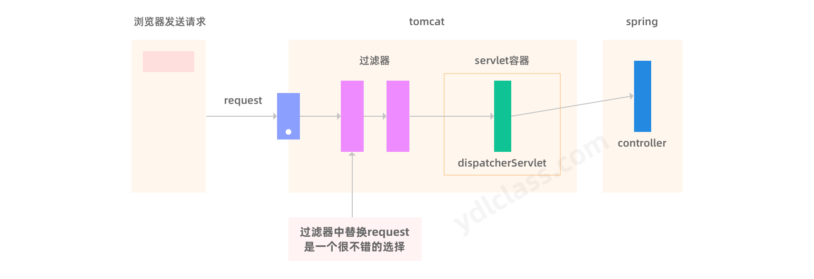


首先，我们先编写一个工具类用来处理字符串中的标签，我们只做简单处理，将半角的尖括号转化为全角：

```java
public class XssUtil {
    /**
     * 将容易引起xss漏洞的半角字符直接替换成全角字符
     * @param s
     * @return
     */
    public static String xssEncode(String s) {
        if (s == null || "".equals(s)) {
            return s;
        }
        StringBuilder sb = new StringBuilder(s.length() + 16);
        for (int i = 0; i < s.length(); i++) {
            char c = s.charAt(i);
            switch (c) {
                case '>':
                    sb.append('＞');//全角大于号
                    break;
                case '<':
                    sb.append('＜');//全角小于号
                    break;
                case '\'':
                    sb.append('‘');//全角单引号
                    break;
                case '\"':
                    sb.append('“');//全角双引号
                    break;
                case '&':
                    sb.append('＆');//全角
                    break;
                case '\\':
                    sb.append('＼');//全角斜线
                    break;
                case '#':
                    sb.append('＃');//全角井号
                    break;
                default:
                    sb.append(c);
                    break;
            }
        }
        return sb.toString();
    }

}
```

我们对request进行一个包装，在包装的request中将参数统一进行处理：

```java
public class XssHttpServletRequestWrapper extends HttpServletRequestWrapper {

    private final HttpServletRequest orgRequest;

    public XssHttpServletRequestWrapper(HttpServletRequest request) {
        super(request);
        orgRequest = request;
    }

    // 重写这几个方法，并且处理xss
    @Override
    public String getParameter(String name) {
        return XssUtil.xssEncode(super.getParameter(XssUtil.xssEncode(name)));
    }

    @Override
    public Map<String, String[]> getParameterMap() {
        Map<String, String[]> parameterMap = super.getParameterMap();
        Map<String, String[]> newParameterMap = new HashMap<>(8);
        for(Map.Entry<String, String[]> entry : parameterMap.entrySet()){
            // 处理key的标签
            String newKey = XssUtil.xssEncode(entry.getKey());
            // 处理value的标签
            String[] params = entry.getValue();
            String[] newParams = new String[params.length];
            for (int i = 0; i < params.length; i++) {
                newParams[i] = XssUtil.xssEncode(params[i]);
            }
            newParameterMap.put(newKey,newParams);
        }
        return newParameterMap;
    }

    @Override
    public String[] getParameterValues(String name) {
        String[] parameterValues = super.getParameterValues(XssUtil.xssEncode(name));
        String[] newParams = new String[parameterValues.length];
        for (int i = 0; i < parameterValues.length; i++) {
            newParams[i] = XssUtil.xssEncode(parameterValues[i]);
        }
        return newParams;
    }

    // 如果将来想继续使用原始的request，可以通过这个方法获取
    public HttpServletRequest getOrgRequest() {
        return orgRequest;
    }
}
```


> 写一个过滤器，将原生的request给置换掉 

```java
public class XssFilter implements Filter {
    @Override
    public void doFilter(ServletRequest servletRequest, ServletResponse servletResponse, FilterChain filterChain) throws IOException, ServletException {
        // 这个过滤器的左右，仅仅是讲原始的request进行一个包装，通过子类去处理恶意标签
        filterChain.doFilter(new XssHttpServletRequestWrapper((HttpServletRequest) servletRequest),servletResponse);
    }
}
```


